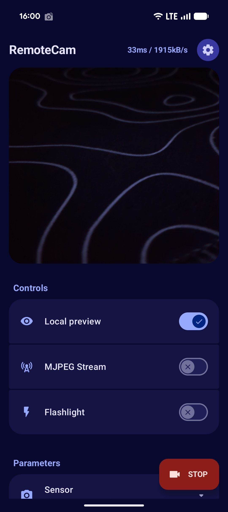

<h1 align="center">📸 RemoteCamEnhanced ^^</h1>

### what is this

RemoteCamEnhanced is a fork of [Ruddle’s RemoteCam](https://github.com/Ruddle/RemoteCam),  
turned into a **real alternative to DroidCam**: no paywalls, no ads, full features.

stream your Android camera to your PC with a clean **Material 3 (Monet)** design,  
modern code, and the goal of matching *everything* DroidCam can do (and more soon :3)

---

### what’s new

- material you ui (dynamic colors, expressive design)
- obs + v4l2 compatible
- cleaner codebase and faster streaming
- still light and simple to use ^^

---

### how it works

pick a sensor → app captures frames →  
they’re sent over http as an mjpeg stream to your pc.

```

http://<your-phone-ip>:8080/cam.mjpeg

````

works directly in browsers, OBS, or ffmpeg.

<p align="center">
  
</p>

---

### download

👉 [**download remotecam-enhanced.apk**](https://github.com/alan7383/RemoteCam-Enhanced/releases)

not on play store

---

### use cases

**in obs:**  
add a browser or media source →  
paste your stream url (like `http://192.168.x.x:8080/mjpeg`)  
browser source = lowest latency.


**linux (v4l2):**
```bash
ffmpeg -i http://192.168.x.x:8080/mjpeg -f v4l2 /dev/video0
````

---

### contributing 💡

I’m **open to contributions**!
Feel free to submit a **pull request** for:

* adding new **translations / languages** to the app
* improving the **codebase**, refactoring, optimizations
* UI tweaks, bug fixes, new ideas, etc.

If you want to help, just make a PR, I’ll check it as soon as possible ^^

---

### why

droidcam is good, but most features are behind a paywall.
remotecamenhanced aims to be a **true open-source replacement**,
with hd video, obs/v4l2 support, clean material design, and no bs :)

no ads, no trackers, no locked options, just your camera doing its thing ^^

---

### license

based on [RemoteCam](https://github.com/Ruddle/RemoteCam) (MIT)
this fork is also under the **MIT license**

---

<p align="center">
  made with ☕ and a bit of chaos by <a href="https://github.com/alan7383">alan7383</a> (´･ω･`)
</p>
