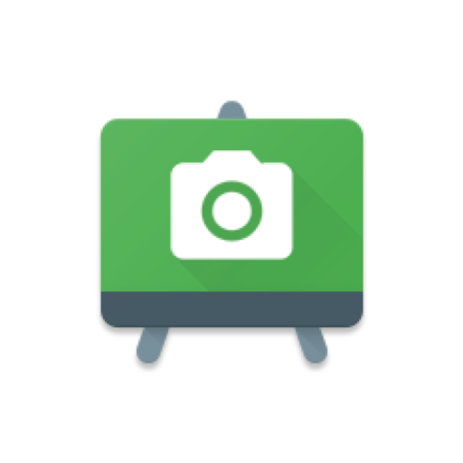
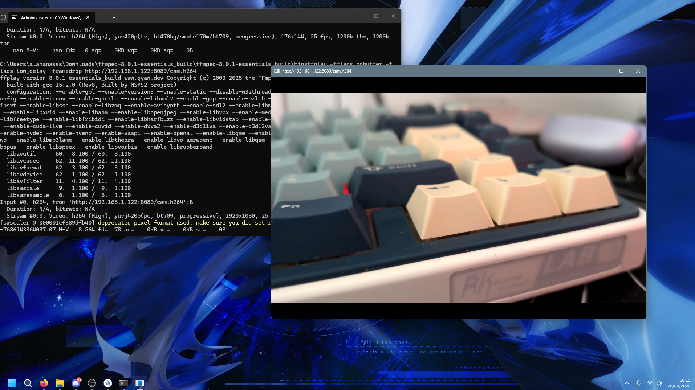

<p align="center">
  
</p>

<h1 align="center">RemoteCam Enhanced ヽ(・∀・)ﾉ</h1>

<p align="center">
  <a href="https://github.com/alan7383/RemoteCam-Enhanced/blob/main/LICENSE">
    
  </a>
  <a href="https://github.com/alan7383/RemoteCam-Enhanced/releases">
    
  </a>
  
</p>

<p align="center">
  <strong>A real, full-featured alternative to DroidCam.</strong><br>
  No paywalls, no ads, no locked resolutions. Just your phone's camera streaming to your PC.
</p>

---

### ~ what is this

RemoteCam Enhanced is a fork of [Ruddle’s RemoteCam](https://github.com/Ruddle/RemoteCam), designed to match (and exceed) what paid apps do, while keeping it lightweight and open-source.

It streams your Android camera over HTTP as an MJPEG or H.264 stream, wrapped in a clean **Material 3 (Monet)** interface. 

---

### * features

<details open>
<summary><b>~ core streaming</b></summary>

*   **mjpeg** and **experimental h.264 (beta)** support.
*   Works directly in browsers, OBS, FFmpeg, etc.
*   Background streaming (keeps running even if you switch apps).
*   Auto-reconnect support for clients.
*   Customizable HTTP port.
</details>

<details>
<summary><b>> camera & video</b></summary>

*   Select any available sensor (front, back, external).
*   Customizable resolution and JPEG quality.
*   Target FPS configuration.
*   Anti-flicker banding mode (50Hz, 60Hz, auto).
*   Noise reduction settings (off, fast, high quality).
*   Video stabilization toggle (OIS/EIS) to improve latency on a tripod.
</details>

<details>
<summary><b>+ controls & interaction</b></summary>

*   Smooth zoom with adjustable smoothing delay.
*   Double-tap actions (switch camera, toggle zoom).
*   Volume key mapping (control zoom, switch camera, toggle flash).
*   Flashlight toggle and **brightness control** on supported devices.
</details>

<details>
<summary><b># power & screen management</b></summary>

*   Auto-dim screen after a set delay to save battery.
*   Input lock when dimmed to prevent accidental touches.
*   Wakelock / keep screen on options.
*   Shortcut to ignore battery optimizations for stable long streams.
</details>

<details>
<summary><b>% ui & design</b></summary>

*   Clean Material You (Monet) dynamic theming.
*   Dark / Light mode support.
*   Multiple languages (English, French, Hungarian, Portuguese).
</details>

---

### * how it works

Pick a sensor, adjust your settings, and start streaming over your local network.

| Format | Endpoint URL |
| :--- | :--- |
| **MJPEG** | `http://<your-phone-ip>:8080/cam.mjpeg` |
| **H.264 (Beta)** | `http://<your-phone-ip>:8080/cam.h264` |

<p align="center">
  
</p>

---

### > use cases

#### **in obs**
Add a `Browser` or `Media Source`, then paste your stream URL.  
> ~ *Tip: using a browser source usually gives the lowest latency for MJPEG.*

<p align="center">
  
</p>

#### **linux (v4l2) with ffmpeg**
Route the stream directly to a virtual camera device:

```bash
# for mjpeg:
ffmpeg -i http://192.168.x.x:8080/cam.mjpeg -f v4l2 /dev/video0

# for h.264 (beta):
ffmpeg -i http://192.168.x.x:8080/cam.h264 -c:v copy -f v4l2 /dev/video0
```

<p align="center">
  
  <br><em>Example of the H.264 stream running smoothly.</em>
</p>

---

### + download

<p align="center">
  <a href="https://github.com/alan7383/RemoteCam-Enhanced/releases">
    
  </a>
</p>

*(Not available on the Play Store)*

---

### ~ contributing (ﾉ◕ヮ◕)ﾉ*:･ﾟ✧

I'm very open to contributions! Feel free to submit a pull request if you want to help out with:

*   Adding new translations / languages.
*   Improving the codebase, refactoring, or optimizing performance.
*   UI tweaks, bug fixes, or entirely new ideas.

---

### ? why?

Apps like DroidCam are great, but most of the cool features (like HD video, FPS controls, etc.) are locked behind a paywall. This project aims to be a true open-source replacement. You get HD video, OBS/V4L2 support, a clean material design, and zero bs.

---

### * credits & license

*   Based on the original [RemoteCam](https://github.com/Ruddle/RemoteCam) by Ruddle (MIT).
*   Flashlight brightness control inspired by [cyb3rko/flashdim](https://github.com/cyb3rko/flashdim).

This fork is also under the **MIT license**.

---

<p align="center">
  made with ( ˘▽˘)っ♨ and a bit of chaos by <a href="https://github.com/alan7383">alan7383</a> (´･ω･`)
</p>