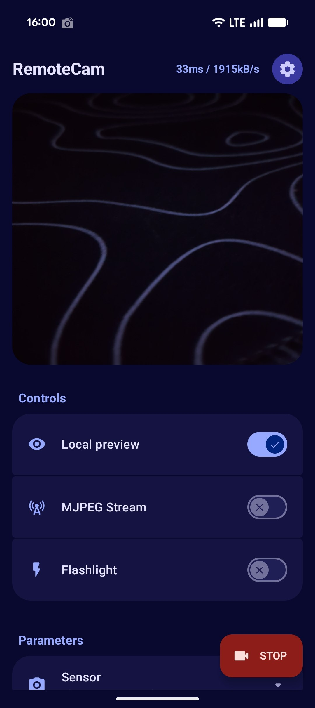

<h1 align="center">RemoteCam Enhanced ヽ(・∀・)ﾉ</h1>

### what is this

RemoteCam Enhanced is a fork of[Ruddle’s RemoteCam](https://github.com/Ruddle/RemoteCam), turned into a real, full-featured alternative to DroidCam. 
No paywalls, no ads, no locked resolutions. Just your phone's camera streaming to your PC.

It streams your Android camera over HTTP as an MJPEG stream, wrapped in a clean Material 3 (Monet) interface. The code is modernized, and the goal is to match (and exceed) what paid apps do, while keeping it lightweight and open-source.

---

### features

**core streaming**
*   mjpeg stream over http (works directly in browsers, obs, ffmpeg, etc.)
*   background streaming (keeps running even if you switch apps)
*   auto-reconnect support for clients
*   customizable http port

**camera & video**
*   select any available sensor (front, back, external)
*   customizable resolution and jpeg quality
*   target fps configuration
*   anti-flicker banding mode (50hz, 60hz, auto)
*   noise reduction settings (off, fast, high quality)
*   video stabilization toggle (ois/eis) to improve latency on a tripod

**controls & interaction**
*   smooth zoom with adjustable smoothing delay
*   double-tap actions (switch camera, toggle zoom)
*   volume key mapping (control zoom, switch camera, toggle flash)
*   flashlight toggle and **brightness control** on supported devices (massive thanks to [cyb3rko/flashdim](https://github.com/cyb3rko/flashdim) for the implementation reference!)

**power & screen management**
*   auto-dim screen after a set delay to save battery
*   input lock when dimmed to prevent accidental touches
*   wakelock / keep screen on options
*   shortcut to ignore battery optimizations for stable long streams

**ui & design**
*   clean material you (monet) dynamic theming
*   dark / light mode support
*   multiple languages (english, french, hungarian, portuguese)

---

### how it works

pick a sensor, adjust your settings, and the app starts capturing frames.  
they are sent over your local network as an mjpeg stream.

```text
http://<your-phone-ip>:8080/cam.mjpeg
```

<p align="center">
  
</p>

---

### use cases

**in obs**  
add a `Browser` or `Media Source`, then paste your stream url (e.g. `http://192.168.x.x:8080/cam.mjpeg`).  
*tip: using a browser source usually gives the lowest latency.*


**linux (v4l2)**  
you can route the stream directly to a virtual camera device:
```bash
ffmpeg -i http://192.168.x.x:8080/cam.mjpeg -f v4l2 /dev/video0
```

---

### download

>> [**download remotecam-enhanced.apk**](https://github.com/alan7383/RemoteCam-Enhanced/releases)

(not available on the play store)

---

### contributing (ﾉ◕ヮ◕)ﾉ*:･ﾟ✧

i'm very open to contributions! feel free to submit a pull request if you want to help out with:

*   adding new translations / languages
*   improving the codebase, refactoring, or optimizing performance
*   ui tweaks, bug fixes, or entirely new ideas

just make a pr and i'll review it as soon as i can ^^

---

### why?

apps like droidcam are great, but most of the cool features (like hd video, fps controls, etc.) are locked behind a paywall.
this project aims to be a true open-source replacement. you get hd video, obs/v4l2 support, a clean material design, and zero bs.

no ads, no trackers, no locked options. just your camera doing its thing.

---

### credits & license

*   based on the original [RemoteCam](https://github.com/Ruddle/RemoteCam) by Ruddle (MIT)
*   flashlight brightness control implementation inspired by [cyb3rko/flashdim](https://github.com/cyb3rko/flashdim)

this fork is also under the **MIT license**.

---

<p align="center">
  made with ( ˘▽˘)っ♨ and a bit of chaos by <a href="https://github.com/alan7383">alan7383</a> (´･ω･`)
</p>